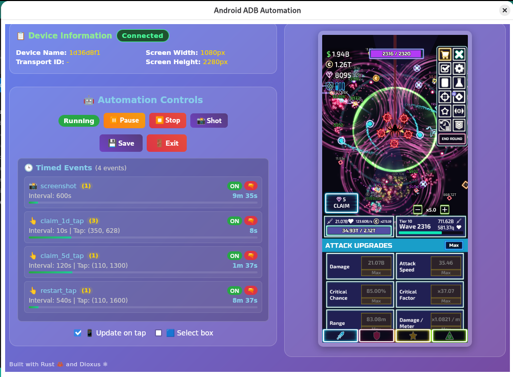

# Android ADB Automation

**Automate your Android device interactions with a simple desktop GUI**

Control and automate your Android phone directly from your computer. View your phone's screen in real-time, tap anywhere to interact, and automate repetitive tasks - all without touching your device.


*Control your Android device from your desktop - view, tap, swipe, and automate*

## What does it do?

- 📱 **View your phone screen** in real-time on your computer
- 👆 **Tap and swipe** by clicking on the screenshot
- 🤖 **Automate repetitive tasks** with image recognition
- 🎮 **Game automation** - auto-click buttons, collect rewards, level up
- 📸 **Take screenshots** quickly and easily
- 🔄 **Works over USB or WiFi** - no root required

## Quick Start

### Step 1: Download the App

Download the latest version for your operating system:

- **Windows**: [android-adb-run-windows-x86_64.exe](https://github.com/diepes/rust-android-adb-automation/releases/latest)
- **macOS (Intel)**: [android-adb-run-macos-x86_64.tar.gz](https://github.com/diepes/rust-android-adb-automation/releases/latest)
- **macOS (Apple Silicon/M1/M2)**: [android-adb-run-macos-aarch64.tar.gz](https://github.com/diepes/rust-android-adb-automation/releases/latest)
- **Linux**: [android-adb-run-linux-x86_64.tar.gz](https://github.com/diepes/rust-android-adb-automation/releases/latest)

### Step 2: Enable USB Debugging on Your Phone

1. Go to **Settings** → **About Phone**
2. Tap **"Build Number"** 7 times to unlock Developer Options
3. Go to **Settings** → **Developer Options**
4. Enable **"USB Debugging"**

### Step 3: Connect and Run

1. **Connect your phone** via USB cable
2. **Run the app**:
   - **Windows**: Double-click `android-adb-run-windows-x86_64.exe`
   - **macOS/Linux**: Extract the archive and run `./android-adb-run --gui`
3. **Allow USB debugging** when the prompt appears on your phone

That's it! Your phone's screen will appear in the app. Click anywhere to interact with your device.

## Features

### 🎮 Game Automation
- Automatically tap buttons and collect rewards
- Image recognition to find specific elements on screen
- Set up repeating actions with timers
- Pause/resume automation anytime

### 📸 Screenshot Tools
- Capture your phone screen instantly
- Save screenshots as PNG files
- Auto-refresh to see changes in real-time

### 🖱️ Remote Control
- Click anywhere on the screenshot to tap your phone
- Drag to perform swipe gestures
- Draw selection boxes to measure areas
- See exactly where you've tapped with visual markers

## Use Cases

- **Mobile gaming**: Automate repetitive grinding, farming, or collecting rewards
- **App testing**: Quickly test UI interactions and workflows
- **Remote control**: Control your phone from your computer
- **Screenshots**: Capture and save phone screens easily
- **Hands-free operation**: Control your phone without picking it up

---

## Need Help?

- **Connection issues?** Make sure USB debugging is enabled and you've approved the USB debugging prompt on your phone
- **App not detecting phone?** Try unplugging and reconnecting the USB cable
- **Want to use WiFi instead?** See the [wireless setup guide](android-adb-run/README.md#wireless-connection)

## Building from Source

Want to compile it yourself? You'll need [Rust installed](https://rustup.rs/).

```bash
git clone https://github.com/diepes/rust-android-adb-automation
cd rust-android-adb-automation/android-adb-run
cargo run --release -- --gui
```

**Note**: Replace `diepes` with the actual GitHub username in all download links above.

---

**Technical Details**: Built with Rust using ADB (Android Debug Bridge). No root or special permissions needed - just USB debugging.

---

## License

This project is dual-licensed under:

### 🆓 For Personal & Open Source Use
- **AGPL-3.0** - Free for personal, educational, and open-source projects
- You must share your source code if you distribute or modify this software
- Perfect for hobbyists, students, and open-source developers

### 💼 For Commercial Use
- **Commercial License** - Required for businesses and closed-source applications
- Keep your source code private
- No open-source obligations
- Includes commercial support

**Pricing:**
- 👤 Single Developer: **$49/year**
- 👥 Small Team (up to 5): **$299/year**
- 🏢 Enterprise: **Contact for custom pricing**

**Need a commercial license?** Contact us at: **[your-email@example.com]**

See [LICENSE](LICENSE) for full legal terms.

---

### Why Dual License?

We believe in open source, but also need to sustain development. This model allows:
- ✅ **Free use** for hobbyists and open-source projects
- ✅ **Fair compensation** for commercial use
- ✅ **Active development** and support from revenue
- ✅ **Community contributions** from open-source users

Similar to how MongoDB, GitLab, and Qt are licensed.
